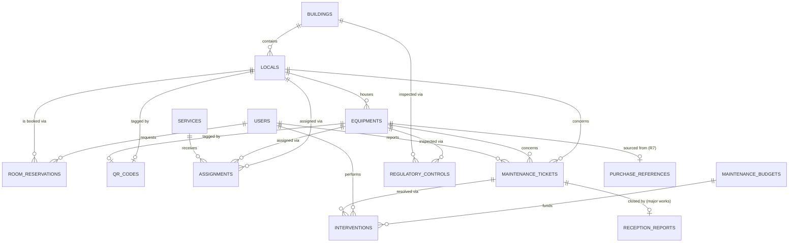

# SCHEMA.md — Data model for R13 "Patrimoine"

Source: *PUI‑UBMA — Workflows par Rubrique v4, page 21/23, R13 Patrimoine*.
This schema covers everything explicitly described on that page (inventory, QR codes,
assignments, room booking, maintenance tickets, closure/PV, regulatory controls) plus the
integration points it references (R7 achats, R9 calendrier, R10 finances).

> This module is one rubrique of a larger ERP. Table/column names are kept generic enough
> (English snake_case) that future rubriques (R1–R12, R14–R23) can be added as their own
> migration sets without renaming anything here.

---

## 0. Conventions

- Tables: English, snake_case, plural (`buildings`, `maintenance_tickets`…).
- Primary keys: `id` (bigint, unsigned, auto‑increment) unless a UUID is specifically needed
  (equipment `qr_token` uses a UUID/opaque token — see §2.3 — but the row PK stays bigint).
- All tables have `created_at`, `updated_at`; soft‑deletable tables also have `deleted_at`.
- Foreign keys: `{singular_table}_id`, indexed, `->constrained()->cascadeOnUpdate()->restrictOnDelete()`
  unless stated otherwise (we generally **restrict** deletes on patrimoine data — assets and
  buildings are never hard‑deleted casually; use a `status`/`archived_at` column instead).
- Money columns: `decimal(12,2)`, currency assumed DZD unless a `currency` column says otherwise.
- Enum‑like columns are implemented as Postgres `enum` types or `string` + app‑level enum class
  (`string` + PHP enum is easier to evolve — prefer that unless you have a strong reason not to).

---

## 1. Entity overview

| Table | Purpose | Maps to workflow step |
|---|---|---|
| `users` | All human actors (staff, teachers, students, technicians…) | all |
| `roles` / `permissions` (Spatie) | RBAC | all |
| `faculties` | Faculté / Rectorat org unit | actor scoping (N2, N3) |
| `services` | Service / Labo / Bureau (assignable org unit) | Étape 2 |
| `buildings` | Bâtiment | Objet, Étape 1 |
| `locals` | Local (salle, bureau, labo, amphi…) | Étape 1, 3 |
| `equipments` | Bien mobilier/équipement | Étape 1 |
| `qr_codes` | One opaque QR token per trackable asset (equipment **or** local) | Étape 1, 4 |
| `assignments` | Affectation d'un bien à un service/local/personne | Étape 2 |
| `room_reservations` | Réservation de salle | Étape 3 |
| `maintenance_tickets` | Ticket de signalement/maintenance | Étape 4, 5, 6 |
| `interventions` | Intervention technique réalisée sur un ticket | Étape 5 |
| `reception_reports` (PV réception) | PV de réception pour travaux, signé PAdES | Étape 6 |
| `regulatory_controls` | Contrôle réglementaire (extincteurs, ascenseurs, électricité…) | Interface module 5 |
| `maintenance_budgets` | Référence budget maintenance (lien R10) | Intégrations |
| `purchase_references` (lien R7) | Référence achat équipement (lien R7) | Intégrations |
| `activity_log` (Spatie) | Audit trail | Security.md |
| `notifications` (Laravel) | Database notifications — source of truth behind the realtime (Reverb) pings | reservation/ticket/SLA/PV/budget/control notification steps |

---

## 2. Table detail

### 2.1 `buildings` (Bâtiments)
| Column | Type | Notes |
|---|---|---|
| id | bigint pk | |
| faculty_id | fk → faculties, nullable | *(added in Phase 2, 2026‑07‑05 — this page originally omitted it, but N2 faculty scoping (`Security.md` §3), Phase 5 approval routing by the room's faculty, and the legacy map's data shape all require it; NULL = central/shared building)* |
| code | string, unique | e.g. `BAT-A` |
| name | string | |
| campus | string, nullable | supports multi‑site UBMA |
| address | string, nullable | |
| floors_count | smallint, nullable | |
| latitude / longitude | decimal, nullable | feeds "Cartographie campus" |
| status | enum: `active, under_renovation, decommissioned` | |

### 2.2 `locals` (Locaux)
| Column | Type | Notes |
|---|---|---|
| id | bigint pk | |
| building_id | fk → buildings | |
| code | string, unique | |
| name | string | |
| type | enum: `bureau, salle_cours, amphi, labo, atelier, entrepot, salle_reunion, autre` | |
| floor | smallint, nullable | |
| capacity | smallint, nullable | for room booking |
| surface_m2 | decimal(8,2), nullable | |
| responsible_user_id | fk → users, nullable | point of contact for this local (e.g. a lab's day‑to‑day contact); any user, no dedicated role |
| status | enum: `available, occupied, under_maintenance, closed` | |

### 2.3 `equipments` (Biens / Équipements)
| Column | Type | Notes |
|---|---|---|
| id | bigint pk | |
| inventory_code | string, unique | printed on the physical QR label |
| designation | string | |
| category / sub_category | string | |
| brand / model / serial_number | string, nullable | |
| local_id | fk → locals, nullable | current physical location |
| acquisition_date | date, nullable | |
| acquisition_value | decimal(12,2), nullable | |
| purchase_reference_id | fk → purchase_references, nullable | **lien R7** |
| warranty_end_date | date, nullable | |
| status | enum: `in_service, under_repair, decommissioned, lost` | |
| condition | enum: `new, good, worn, damaged` | "état" in the workflow |
| photo_path | string, nullable | |
| notes | text, nullable | |

### 2.4 `qr_codes`
| Column | Type | Notes |
|---|---|---|
| id | bigint pk | |
| trackable_type / trackable_id | morph columns | polymorphic → `equipments` **or** `locals` |
| token | uuid, unique | **opaque**, not the DB id — never expose sequential IDs in a public QR (see `Security.md`) |
| generated_at | timestamp | |
| printed | boolean, default false | operational tracking of label printing |

### 2.5 `services` (Service / Labo / Bureau)
| Column | Type | Notes |
|---|---|---|
| id | bigint pk | |
| faculty_id | fk → faculties, nullable | |
| name | string | |
| type | enum: `service, labo, bureau` | |
| responsible_user_id | fk → users, nullable | maps to N2 or delegate |

### 2.6 `assignments` (Affectations)
| Column | Type | Notes |
|---|---|---|
| id | bigint pk | |
| equipment_id | fk → equipments, nullable | either equipment... |
| local_id | fk → locals, nullable | ...or a whole local is affected — one of the two required |
| service_id | fk → services, nullable | |
| assigned_to_user_id | fk → users, nullable | individual responsible, if applicable |
| assigned_by_user_id | fk → users | A3 or N2 |
| start_date | date | |
| end_date | date, nullable | |
| notes | text, nullable | |

### 2.7 `room_reservations` (Réservations de salle)
| Column | Type | Notes |
|---|---|---|
| id | bigint pk | |
| local_id | fk → locals | |
| requested_by_user_id | fk → users | Enseignant only (booking-initiator role — policy 2026-07-04); recurring course slots supported |
| purpose | string | |
| start_at / end_at | timestamp | indexed together for overlap checks |
| recurring_rule | string, nullable | RRULE-style, for teachers' weekly course slots |
| status | enum: `pending, confirmed, rejected, cancelled` | |
| approved_by_user_id | fk → users, nullable | |
| external_calendar_ref | string, nullable | **lien R9** calendrier partagé |

Add a DB‑level exclusion constraint (or app‑level check) preventing overlapping **confirmed**
reservations on the same `local_id`.

### 2.8 `maintenance_tickets`
| Column | Type | Notes |
|---|---|---|
| id | bigint pk | |
| equipment_id | fk → equipments, nullable | |
| local_id | fk → locals, nullable | ticket can target a room (e.g. leak) without one specific asset |
| reported_by_user_id | fk → users | |
| source | enum: `qr_scan, manual, auto` | Étape 4 — "scan QR → ticket auto" |
| description | text | |
| priority | enum: `urgent, standard` | drives SLA |
| sla_due_at | timestamp | computed at creation: `+48h` urgent / `+5j` standard |
| category | string | electrique, plomberie, informatique, mobilier… |
| status | enum: `new, assigned, in_progress, resolved, closed, cancelled` | drives the drag‑and‑drop Kanban board columns in the UI — see `ui-design.md` §5/§6 |
| assigned_service_id | fk → services, nullable | routes to "Service technique" |

### 2.9 `interventions`
| Column | Type | Notes |
|---|---|---|
| id | bigint pk | |
| maintenance_ticket_id | fk → maintenance_tickets | |
| technician_id | fk → users, nullable | a `users` row belonging to Service technique — no dedicated "technician" role, just membership in that group |
| scheduled_at / completed_at | timestamp, nullable | |
| report | text, nullable | compte‑rendu |
| cost | decimal(12,2), nullable | feeds `maintenance_budgets` |
| status | enum: `planned, in_progress, done, cancelled` | |

### 2.10 `reception_reports` (PV de réception)
| Column | Type | Notes |
|---|---|---|
| id | bigint pk | |
| maintenance_ticket_id | fk → maintenance_tickets, nullable | for major works only |
| amount_threshold_triggered | boolean | whether PAdES was required |
| document_path | string | |
| pades_signature_meta | json, nullable | signer, timestamp, certificate ref |
| signed_by_user_id | fk → users | N2 (standard) or N3 (grands travaux) |
| signed_at | timestamp, nullable | |

### 2.11 `regulatory_controls` (Contrôles réglementaires)
| Column | Type | Notes |
|---|---|---|
| id | bigint pk | |
| controllable_type / controllable_id | morph | building, local, or equipment (e.g. elevator, extinguisher) |
| control_type | string | fire safety, elevator, electrical, accessibility… |
| performed_by | string | usually an external certified inspection body — free text, not a system user/role |
| result | enum: `compliant, non_compliant, pending` | |
| certificate_path | string, nullable | |
| last_control_date / next_due_date | date | |

### 2.12 `maintenance_budgets` (lien R10)
| Column | Type | Notes |
|---|---|---|
| id | bigint pk | |
| fiscal_year | smallint | |
| scope_type / scope_id | morph, nullable | building/service scope, nullable = global |
| allocated_amount | decimal(12,2) | |
| consumed_amount | decimal(12,2), default 0 | recomputed from `interventions.cost` |
| approval_status | enum: `draft, submitted, approved, rejected` | approved by N2 (standard) / N3 (above threshold) — no separate finance role, see §6 |

### 2.13 `purchase_references` (lien R7)
| Column | Type | Notes |
|---|---|---|
| id | bigint pk | |
| external_purchase_id | string | id/reference from module R7 |
| supplier | string, nullable | |
| order_date | date, nullable | |

---

## 3. Relationships (ERD)



---

## 4. SLA computation rule (Étape 5)

```
sla_due_at = created_at + (priority == 'urgent' ? 48 hours : 5 business days)
```
Implement as a model event/observer on `maintenance_tickets`, not scattered inline logic.
App timezone is `Africa/Algiers` end-to-end (set 2026-07-05) — business-day arithmetic operates
on local dates; the exact holiday/weekend calendar is still the §6 `TODO(confirm)`.
Escalation (unassigned ticket past X% of SLA) is a queued job — see `Phases.md` Phase 7.

---

## 5. Indexing & performance notes
- `equipments.inventory_code`, `qr_codes.token` → unique indexes (hot lookup path for QR scans).
- `room_reservations (local_id, start_at, end_at)` → composite index for overlap queries.
- `maintenance_tickets (status, sla_due_at)` → composite index for the escalation scheduler.
- Use `withCount`/eager loading everywhere in Filament tables to avoid N+1 (see `Security.md` §6
  performance section — this is also a DoS‑resilience concern, not just a nicety).

---

## 6. Open questions to confirm with the university (do not guess)
- Exact SLA business‑day calendar (holidays, weekends) for "standard ≤ 5j".
- Monetary threshold above which N3/Rectorat approval and PAdES signature are mandatory
  (workflow says "PAdES si > seuil" but the seuil itself isn't given on this page).
- Whether `regulatory_controls.performed_by` should become a real `users`/`vendors` relation
  once external inspection bodies need portal access.
