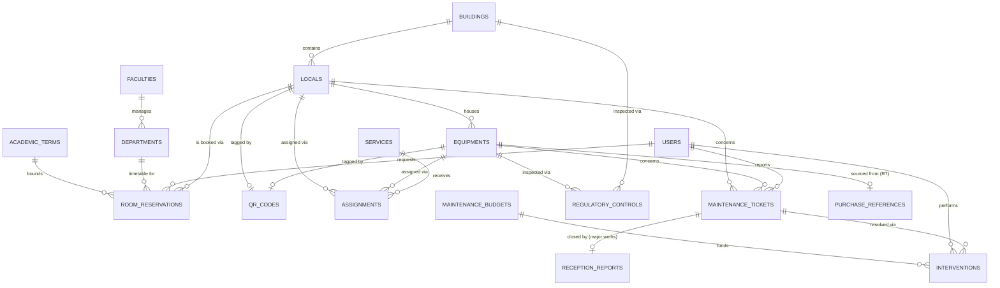

# SCHEMA.md — Data model for R13 "Patrimoine"

Source: *PUI‑UBMA — Workflows par Rubrique v4, page 21/23, R13 Patrimoine*.
This schema covers everything explicitly described on that page (inventory, QR codes,
assignments, room booking, maintenance tickets, closure/PV, regulatory controls) plus the
integration points it references (R7 achats, R9 calendrier, R10 finances).

> This module is one rubrique of a larger ERP. Table/column names are kept generic enough
> (English snake_case) that future rubriques (R1–R12, R14–R23) can be added as their own
> migration sets without renaming anything here.

---

## 0. Conventions

- Tables: English, snake_case, plural (`buildings`, `maintenance_tickets`…).
- Primary keys: `id` (bigint, unsigned, auto‑increment) unless a UUID is specifically needed
  (equipment `qr_token` uses a UUID/opaque token — see §2.3 — but the row PK stays bigint).
- All tables have `created_at`, `updated_at`; soft‑deletable tables also have `deleted_at`.
- Foreign keys: `{singular_table}_id`, indexed, `->constrained()->cascadeOnUpdate()->restrictOnDelete()`
  unless stated otherwise (we generally **restrict** deletes on patrimoine data — assets and
  buildings are never hard‑deleted casually; use a `status`/`archived_at` column instead).
- Money columns: `decimal(12,2)`, currency assumed DZD unless a `currency` column says otherwise.
- Enum‑like columns are implemented as Postgres `enum` types or `string` + app‑level enum class
  (`string` + PHP enum is easier to evolve — prefer that unless you have a strong reason not to).

---

## 1. Entity overview

| Table | Purpose | Maps to workflow step |
|---|---|---|
| `users` | All human actors (staff, teachers, students, technicians…) | all |
| `roles` / `permissions` (Spatie) | RBAC | all |
| `faculties` | Faculté / Rectorat org unit | actor scoping (N2, N3) |
| `services` | Service / Labo / Bureau (assignable org unit) | Étape 2 |
| `buildings` | Bâtiment | Objet, Étape 1 |
| `locals` | Local (salle, bureau, labo, amphi…) | Étape 1, 3 |
| `equipments` | Bien mobilier/équipement | Étape 1 |
| `qr_codes` | One opaque QR token per trackable asset (equipment **or** local) | Étape 1, 4 |
| `assignments` | Affectation d'un bien à un service/local/personne | Étape 2 |
| `departments` | Département d'une faculté *(added 2026-07-06, Phase 5 addendum)* | Étape 3 (organizes the timetable) |
| `academic_terms` | Semestre académique — l'année compte 2 semestres *(added 2026-07-06)* | Étape 3 (bounds the timetable's recurrence) |
| `room_reservations` | Réservation de salle | Étape 3 |
| `maintenance_tickets` | Ticket de signalement/maintenance | Étape 4, 5, 6 |
| `interventions` | Intervention technique réalisée sur un ticket | Étape 5 |
| `reception_reports` (PV réception) | PV de réception pour travaux, signé PAdES | Étape 6 |
| `regulatory_controls` | Contrôle réglementaire (extincteurs, ascenseurs, électricité…) | Interface module 5 |
| `maintenance_budgets` | Référence budget maintenance (lien R10) | Intégrations |
| `purchase_references` (lien R7) | Référence achat équipement (lien R7) | Intégrations |
| `activity_log` (Spatie) | Audit trail | Security.md |
| `notifications` (Laravel) | Database notifications — source of truth behind the realtime (Reverb) pings | reservation/ticket/SLA/PV/budget/control notification steps |

---

## 2. Table detail

### 2.1 `buildings` (Bâtiments)
| Column | Type | Notes |
|---|---|---|
| id | bigint pk | |
| faculty_id | fk → faculties, nullable | *(added in Phase 2, 2026‑07‑05 — this page originally omitted it, but N2 faculty scoping (`Security.md` §3), Phase 5 approval routing by the room's faculty, and the legacy map's data shape all require it; NULL = central/shared building)* |
| code | string, unique | e.g. `BAT-A` |
| name | string | |
| campus | string, nullable | supports multi‑site UBMA |
| address | string, nullable | |
| floors_count | smallint, nullable | |
| latitude / longitude | decimal, nullable | feeds "Cartographie campus" |
| status | enum: `active, under_renovation, decommissioned` | |

### 2.2 `locals` (Locaux)
| Column | Type | Notes |
|---|---|---|
| id | bigint pk | |
| building_id | fk → buildings | |
| code | string, unique | |
| name | string | |
| type | enum: `bureau, salle_cours, amphi, labo, atelier, entrepot, salle_reunion, autre` | |
| floor | smallint, nullable | |
| capacity | smallint, nullable | for room booking |
| surface_m2 | decimal(8,2), nullable | |
| responsible_user_id | fk → users, nullable | point of contact for this local (e.g. a lab's day‑to‑day contact); any user, no dedicated role |
| status | enum: `available, occupied, under_maintenance, closed` | |

### 2.3 `equipments` (Biens / Équipements)
| Column | Type | Notes |
|---|---|---|
| id | bigint pk | |
| inventory_code | string, unique | printed on the physical QR label |
| designation | string | |
| category / sub_category | string | `sub_category` nullable *(2026‑07‑05, Phase 3: relaxed — not every asset has a sub‑category)* |
| brand / model / serial_number | string, nullable | |
| local_id | fk → locals, nullable | current physical location |
| acquisition_date | date, nullable | |
| acquisition_value | decimal(12,2), nullable | |
| purchase_reference_id | fk → purchase_references, nullable | **lien R7** |
| warranty_end_date | date, nullable | |
| status | enum: `in_service, under_repair, decommissioned, lost` | |
| condition | enum: `new, good, worn, damaged` | "état" in the workflow |
| photo_path | string, nullable | |
| notes | text, nullable | |

### 2.4 `qr_codes`
| Column | Type | Notes |
|---|---|---|
| id | bigint pk | |
| trackable_type / trackable_id | morph columns | polymorphic → `equipments` **or** `locals` |
| token | uuid, unique | **opaque**, not the DB id — never expose sequential IDs in a public QR (see `Security.md`) |
| generated_at | timestamp | |
| printed | boolean, default false | operational tracking of label printing |

### 2.5 `services` (Service / Labo / Bureau)
| Column | Type | Notes |
|---|---|---|
| id | bigint pk | |
| faculty_id | fk → faculties, nullable | |
| name | string | |
| type | enum: `service, labo, bureau` | |
| responsible_user_id | fk → users, nullable | maps to N2 or delegate |

### 2.6 `assignments` (Affectations)
| Column | Type | Notes |
|---|---|---|
| id | bigint pk | |
| equipment_id | fk → equipments, nullable | either equipment... |
| local_id | fk → locals, nullable | ...or a whole local is affected — one of the two required. *(Phase 4, 2026‑07‑06: when **both** are set, the local is the equipment's destination room and `equipments.local_id` is synced on creation — this is the permissive reading of §1's "affectation d'un bien à un service/**local**/personne" and what makes the Phase 4 DoD "updates its current location" implementable. `TODO(confirm)`: whether the university wants affectation and physical relocation strictly separated instead.)* |
| service_id | fk → services, nullable | |
| assigned_to_user_id | fk → users, nullable | individual responsible, if applicable |
| assigned_by_user_id | fk → users | A3 or N2 |
| start_date | date | |
| end_date | date, nullable | |
| notes | text, nullable | |

### 2.7 `room_reservations` (Réservations de salle)

**Two kinds, one table** *(decision 2026‑07‑06 — see `Security.md` §3, `Phases.md` Phase 5)*:
- **`timetable`** — the faculty's emploi du temps. Entered directly as `confirmed` by N2
  (their own faculty's rooms) or A3 (central/shared rooms); the teacher is picked from a
  dropdown of Enseignant accounts, never typed. This reverses the 2026‑07‑04 wording
  ("recurring slots initiated by teachers") — teachers no longer author their own recurring
  course slots.
- **`request`** — Enseignant‑initiated ad‑hoc/one‑off bookings (makeup classes, defenses,
  meetings) filling whatever gaps remain in the timetable. Starts `pending`; approved by the
  room's‑faculty N2, or **A3 for a central/shared room** (no N2 owns it — gap closed
  2026‑07‑06).

**Phase 5 addendum (2026‑07‑06)**: the academic year splits into 2 semesters; a faculty
manages several departments and fills each one's timetable one semester at a time. `department`
(free text) is promoted to `department_id` (FK to the new `departments` table, §2.14), and
`academic_term_id` (FK to the new `academic_terms` table, §2.15) is added — a `timetable` row's
weekly recurrence now runs to its term's `end_date` (the authoritative boundary), replacing the
previous arbitrary "repeat until" date the form used to ask for.

| Column | Type | Notes |
|---|---|---|
| id | bigint pk | |
| local_id | fk → locals | |
| department_id | fk → departments, nullable | *(2026‑07‑06)* required by the form whenever `module_name` is set (course booking), on either `source`; optional for a non‑course `request` (meeting, defense…) |
| source | enum: `timetable, request` | drives who may create the row, its initial status, and the notification flow — see split above |
| requested_by_user_id | fk → users | who **submitted/entered** this row: N2 or A3 for `timetable`, the Enseignant themself for `request`. **Never typed — always the authenticated account or an explicit picker** |
| teacher_user_id | fk → users, nullable | the teacher this course slot is **for** — required whenever `module_name` is set, regardless of source. Equals `requested_by_user_id` for a teacher's own `request`; explicitly selected by N2/A3 for `timetable` rows (picker over Enseignant accounts, never free text) |
| module_name | string, nullable | *(added 2026-07-05, owner requirement)* course/module being taught — required by the form for course bookings |
| level | string, nullable | L1/L2/L3/M1/M2/Doctorate/Other (PHP enum) — required by the form for course bookings |
| student_group | string, nullable | e.g. "Groupe 3", optional |
| attendees_count | smallint, nullable | validated ≤ `locals.capacity` at request time |
| purpose | string, nullable | for non-course bookings (meetings, defenses…) |
| start_at / end_at | timestamp | indexed together for overlap checks |
| recurring_rule | string, nullable | RRULE-style, for `timetable` weekly course slots; `UNTIL=` is now the owning Academic Term's `end_date` |
| recurring_group_id | uuid, nullable | *(2026‑07‑06 addition beyond the original listing)* ties a generated weekly series together for bulk cancel/edit, without fragile string matching on `recurring_rule` |
| academic_term_id | fk → academic_terms, nullable | *(2026‑07‑06)* required by the form for `source = timetable` rows; the term whose `end_date` bounds the weekly recurrence |
| status | enum: `pending, confirmed, rejected, cancelled` | `timetable` rows are created directly as `confirmed` (no separate approval step — authorship by N2/A3 **is** the approval); `request` rows start `pending` |
| approved_by_user_id | fk → users, nullable | `request` rows only — the room's‑faculty N2, or A3 for central/shared rooms (routing rule, `Security.md` §3). Stays NULL on `timetable` rows |
| external_calendar_ref | string, nullable | **lien R9** calendrier partagé |

Add a DB‑level exclusion constraint (or app‑level check) preventing overlapping **confirmed**
reservations on the same `local_id` — checked across **both** `source` kinds together (a
confirmed timetable slot blocks an overlapping request, and vice versa).

### 2.14 `departments` (Phase 5 addendum, 2026‑07‑06)
| Column | Type | Notes |
|---|---|---|
| id | bigint pk | |
| faculty_id | fk → faculties | required — a department always belongs to exactly one faculty, no shared/central concept (unlike `buildings.faculty_id`) |
| name | string | unique per faculty |
| code | string, nullable | |

FacultyScope applies (N2 sees only their own faculty's departments; A3/N3 unscoped) — same
pattern as `buildings`/`locals`, minus the shared/central branch.

### 2.15 `academic_terms` (Phase 5 addendum, 2026‑07‑06)
| Column | Type | Notes |
|---|---|---|
| id | bigint pk | |
| academic_year | string | e.g. `"2026-2027"` |
| semester | tinyint | `1` or `2` — the academic year is split into 2 semesters |
| label | string | auto-generated from `academic_year`/`semester` if left blank on creation (e.g. "2026-2027 — Semester 1") |
| start_date / end_date | date | the authoritative boundary a `timetable` row's weekly recurrence runs to |

University-wide referential (like `faculties`) — not faculty-scoped. A3-managed; N2/N3 read
it to pick a term when filling/reviewing a timetable.

### 2.8 `maintenance_tickets`
| Column | Type | Notes |
|---|---|---|
| id | bigint pk | |
| reference | string, unique | **Phase 6 addition** — human-readable `TCK-YYYY-NNNNN` display code, same auto-generation pattern as `equipments.inventory_code` (`MaintenanceTicketObserver`) |
| equipment_id | fk → equipments, nullable | |
| local_id | fk → locals, nullable | ticket can target a room (e.g. leak) without one specific asset; CHECK constraint mirrors `assignments`' subject-required pattern (at least one of the two) |
| reported_by_user_id | fk → users | |
| source | enum: `qr_scan, manual, auto` | Étape 4 — "scan QR → ticket auto" |
| description | text | |
| priority | enum: `urgent, standard` | drives SLA |
| sla_due_at | timestamp | computed at creation: `+48h` urgent / `+5j` standard (business-day arithmetic currently only skips Friday — the full holiday calendar is §6 open question #1) |
| category | string, **nullable** (Phase 6 divergence) | electrique, plomberie, informatique, mobilier… — nullable because the legacy report form (`ReportView.tsx`) never collected one for QR-scan reports; `manual` tickets may still set it |
| status | enum: `new, assigned, in_progress, resolved, closed, cancelled` | drives the drag‑and‑drop Kanban board columns in the UI — see `ui-design.md` §5/§6 |
| assigned_service_id | fk → services, nullable | routes to "Service technique" — Phase 6 auto-fills this from the equipment's current active assignment's `service_id` when left blank, else A3 triages manually |
| escalated_at | timestamp, nullable | **Phase 7 addition** — idempotency guard for the SLA-escalation scheduled job (`patrimo:escalate-tickets`): set once a ticket is first notified as approaching/breaching SLA, so the every-15-minutes scheduler tick never re-notifies the same ticket |

**Phase 6 note (2026-07-07):** priority is **always `urgent`** for `source = qr_scan` — the legacy report form never offered a category picker and hardcoded every QR-scan report as urgent/48h SLA (confirmed by direct inspection of `ReportView.tsx`, not guessed). `category` therefore stays a plain classification/routing field on this table, not a priority driver — a category→priority mapping is described informally in `Phases.md`/this section's earlier draft but was never actually implemented anywhere, including the legacy app. Flagged rather than invented; revisit if the university actually wants graduated severity by category.

**Phase 7 note (2026-07-08):** `status`'s transitions are a real state machine (`TicketStatus::canTransitionTo()`), not ad-hoc string checks — linear `new → assigned → in_progress → resolved → closed` (matching both this column order and the legacy `TicketDetailView.tsx`'s own `NEXT_STATUS` map), plus `cancelled` reachable from any non-terminal status as a side branch. One service (`TicketWorkflowService`) is the only place a ticket's status is ever written, so the Kanban drag and a manual status-change action can never drift apart.

### 2.9 `interventions`
| Column | Type | Notes |
|---|---|---|
| id | bigint pk | |
| maintenance_ticket_id | fk → maintenance_tickets | |
| technician_id | fk → users, nullable | a `users` row belonging to Service technique — no dedicated "technician" role, just membership in that group |
| scheduled_at / completed_at | timestamp, nullable | |
| report | text, nullable | compte‑rendu |
| cost | decimal(12,2), nullable | feeds `maintenance_budgets` |
| status | enum: `planned, in_progress, done, cancelled` | independent from the parent ticket's own status |

### 2.10 `reception_reports` (PV de réception)
| Column | Type | Notes |
|---|---|---|
| id | bigint pk | |
| maintenance_ticket_id | fk → maintenance_tickets, nullable | for major works only |
| amount_threshold_triggered | boolean | whether PAdES was required |
| document_path | string | |
| pades_signature_meta | json, nullable | signer, timestamp, certificate ref |
| signed_by_user_id | fk → users | N2 (standard) or N3 (grands travaux) |
| signed_at | timestamp, nullable | |

### 2.11 `regulatory_controls` (Contrôles réglementaires)
| Column | Type | Notes |
|---|---|---|
| id | bigint pk | |
| controllable_type / controllable_id | morph | building, local, or equipment (e.g. elevator, extinguisher) |
| control_type | string | fire safety, elevator, electrical, accessibility… |
| performed_by | string | usually an external certified inspection body — free text, not a system user/role |
| result | enum: `compliant, non_compliant, pending` | |
| certificate_path | string, nullable | |
| last_control_date / next_due_date | date | |

### 2.12 `maintenance_budgets` (lien R10)
| Column | Type | Notes |
|---|---|---|
| id | bigint pk | |
| fiscal_year | smallint | |
| scope_type / scope_id | morph, nullable | building/service scope, nullable = global |
| allocated_amount | decimal(12,2) | |
| consumed_amount | decimal(12,2), default 0 | recomputed from `interventions.cost` |
| approval_status | enum: `draft, submitted, approved, rejected` | approved by N2 (standard) / N3 (above threshold) — no separate finance role, see §6 |

### 2.13 `purchase_references` (lien R7)
| Column | Type | Notes |
|---|---|---|
| id | bigint pk | |
| external_purchase_id | string | id/reference from module R7 |
| supplier | string, nullable | |
| order_date | date, nullable | |

---

## 3. Relationships (ERD)



---

## 4. SLA computation rule (Étape 5)

```
sla_due_at = created_at + (priority == 'urgent' ? 48 hours : 5 business days)
```
Implement as a model event/observer on `maintenance_tickets`, not scattered inline logic.
App timezone is `Africa/Algiers` end-to-end (set 2026-07-05) — business-day arithmetic operates
on local dates; the exact holiday/weekend calendar is still the §6 `TODO(confirm)`.
Escalation (unassigned ticket past X% of SLA) is a queued job — see `Phases.md` Phase 7.

---

## 5. Indexing & performance notes
- `equipments.inventory_code`, `qr_codes.token` → unique indexes (hot lookup path for QR scans).
- `room_reservations (local_id, start_at, end_at)` → composite index for overlap queries.
- `maintenance_tickets (status, sla_due_at)` → composite index for the escalation scheduler.
- Use `withCount`/eager loading everywhere in Filament tables to avoid N+1 (see `Security.md` §6
  performance section — this is also a DoS‑resilience concern, not just a nicety).

---

## 6. Open questions to confirm with the university (do not guess)
- Exact SLA business‑day calendar (holidays, weekends) for "standard ≤ 5j" — **note**: the
  timetable grid's own day set (Sat–Thu) is now confirmed from the legacy app's seed data
  (`ui-design.md` §9.5), but that resolves only the *timetable UI's* week, not this broader
  SLA business‑day question, which stays open.
- Monetary threshold above which N3/Rectorat approval and PAdES signature are mandatory
  (workflow says "PAdES si > seuil" but the seuil itself isn't given on this page).
- Whether `regulatory_controls.performed_by` should become a real `users`/`vendors` relation
  once external inspection bodies need portal access.
